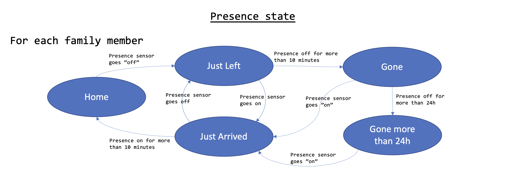
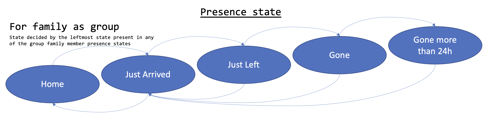

# Presence setup in Home Assistant

[](https://home-assistant.io)

[![Buy me a coffee][buymeacoffee-shield]][buymeacoffee]

[buymeacoffee]: https://www.buymeacoffee.com/klec00
[buymeacoffee-shield]: https://www.buymeacoffee.com/assets/img/custom_images/orange_img.png

Presence detection is useful for controlling a range of automations. Getting the presence detection to work is however sometimes a comlicated task. I make use of a combination of sensors to identify presence fo each family member, combined with a presence state machine that gives provides the flexibility to react on transitional states as well.

## Presence detection
I use [Bayesian binary sensors](https://www.home-assistant.io/integrations/bayesian/) to identify if a person in the household is home or not. I have found that with proper tuning, this setup provides good enough accuracy for my needs. I recommend anyone interested in this approach to read the [How Bayes Sensors work, from a Statistics Professor](https://community.home-assistant.io/t/how-bayes-sensors-work-from-a-statistics-professor-with-working-google-sheets/143177) topic on the Home Assistant community.

For each family member, a Bayesian sensor `userX_home_sensor` is created with different sets of sensor for observations. 

Observations for the Bayesian sensor's include:
|Type|Observation|Source|
|---|---|---|
|Device Sensors|Mobile phone presence in home network|[Netgear](https://www.home-assistant.io/integrations/netgear/) router integration|
||Mobile phone location from HA app (not installed on all phones)|[iOS](https://www.home-assistant.io/integrations/ios/) integration and app|
||iPad and Laptop presence|[Netgear](https://www.home-assistant.io/integrations/netgear/) router integration|
||Car device tracker|[Volvo on call](https://www.home-assistant.io/integrations/volvooncall/) integration|
|Time based sensors|Nighttime|see [Home state setup in Home Assistant](https://github.com/klec00/ha-home-state)|
||Workhour(*)|[Workday](https://www.home-assistant.io/integrations/workday/) and [Times of day](https://www.home-assistant.io/integrations/tod/) integrations|
|Other|Calendar entries|[Google calendar](https://www.home-assistant.io/integrations/calendar.google/) integration|

(*) The Workhour observation parameters had to be tweaked during Covid-19 to accomodate for WFH.

I used to have the home alarm state as a significant contributor as well, setting the presence to away for each family member if the alarm was `armed_away`. The drawback with that was that I could not observe a person coming home before the alarm was unarmed. I couldn't trigger on e.g. mobile phone connecting to home wifi. I have therefore excluded the alarm state for now, and make use of the `input_select.home_alarm_state` (see [Security setup in Home Assistant](https://github.com/klec00/ha-security-state)) as a complementary data point to my automations.

An additonal option could be to also make use of the [Person](https://www.home-assistant.io/integrations/person/) integration, but I've not tried that yet, the above Bayesian binary sensors works just fine for me. 

## Presence state engine
The presence state engine is an adoption of Phil Hawthorne's [making home-assistant presence detection not so binary](https://philhawthorne.com/making-home-assistants-presence-detection-not-so-binary/), and allows for more states than just home/away. This allows for a greater granularity of control and avoid automations triggering to rapidly if a sensor reading suddenly goes wrong.



Some change shas been made to the original scripts referenced above. Most notably the automations make use of `trigger.to_state.entity_id` to extract which user's `input_select.userX_status_dropdown` helper should be updated. 
````
  ...
  entity_id: >
    
    input_select.{{name}}_status_dropdown
  ...
````

While implementing this change, I discovered that if a two person's presence sensors were updated at the same time, the automation's would only update the state for one person. The reason for this was that up until [Home Assistant 0.113](https://community.home-assistant.io/t/0-113-automations-scripts-and-even-more-performance/213387), automations triggered whilst already running would just drop silently. With the new directive `mode: queued`, the automations work just fine.

### Family presence state
In addition to the individual presence states `input_select.userX_status_dropdown`, I am using a template sensor `family_presence_state` to set the presence state of the family. The way the template works is that it returns the "lowest" presence state observed amongst any family member in `group.family_home_sensor`, with the state "Home" being the lowest, and the state "Gone 24h" being the highest. The Family presence state is useful to set the house to simulation mode when family has been away for more than 24h (state = "Gone 24h"). For more information about my house modes and sumulations, see [Home state setup in Home Assistant](https://github.com/klec00/ha-home-state).



The template code to set the `family_presence_state` is not the prettiest I've ever written, and I assume there is a smarter way to achieve the same result:

````
family_presence_state:
  friendly_name: Presence state of family as a group
  value_template: >
    
    
    
    
      
      
      
          
      
    
    
    {{ mapper[ns.status] }}
`````


